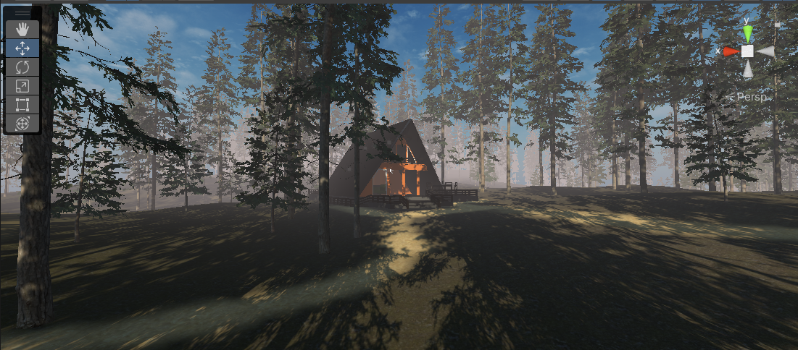
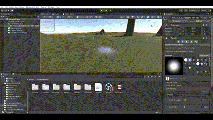
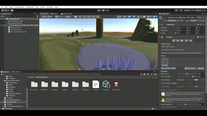
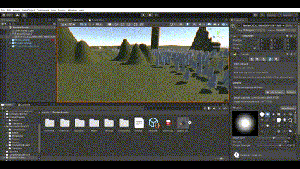
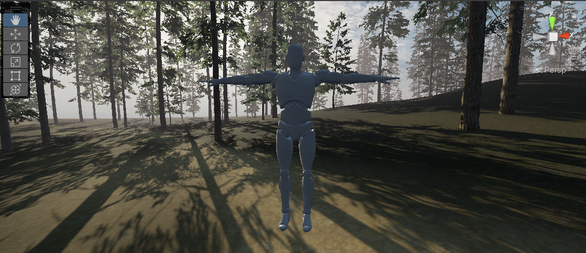

# Unity-
## Программа
- **Unity 2021.3.24f1**
# Unity

 
<i>Логотип программного обеспечения Unity</i>

  

Unity - это кросс-платформенный движок для разработки компьютерных игр и интерактивных приложений. Он позволяет создавать игры для различных платформ, включая ПК, мобильные устройства, виртуальную и дополненную реальность. Unity поддерживает различные языки программирования, в том числе C#, JavaScript и Boo. Он также предоставляет инструменты для создания графики, звука, физики, анимации и искусственного интеллекта. Unity является одним из наиболее популярных и широко используемых движков для создания компьютерных игр и приложений.

## Теория по локации: "Домик в лесу".

 
<i>Домик в лесу на Unity</i>

  

### Ландшафт

В Unity вы можете создать ландшафт с помощью компонента Terrain. Создайте новый объект Terrain, добавьте ему компонент Terrain и настройте его параметры (размер, текстуры, рельеф и т. д.). Например с помощью Raise or Lower Terrain можно менять рельеф.

 
<i>Изменение ландшафта</i>

  

Чтобы создать землю в Unity, можно использовать компонент Plane. Создайте новый объект Plane, настройте его параметры (размер, текстуры и т. д.) и поместите его на сцену. 

Также можно использовать различные инструменты и плагины для создания ландшафта в Unity, например, Terrain Composer или World Machine.

### Деревья

1. В разделе "Terrain Settings" найдите пункт "Paint Trees". Нажмите на кнопку "Edit Trees".
2. В появившемся окне "Tree Editor" нажмите на кнопку "Add Tree".
3. Выберите в списке доступных моделей дерево, которое вы хотите поставить на свой участок земли.
4. Настройте параметры дерева (размер, плотность, случайное расположение и т.д.).
5. Нажмите на кнопку "Paint Trees".
6. Выберите инструмент "Brush" и выберите желаемый размер и форму кисти.
7. Нажмите левой кнопкой мыши на участке земли, где вы хотите поставить деревья. Можно менять настройки дерева и кисти и добавлять новые деревья на тот же участок земли.
   

 
<i>Посадка деревьев</i>

  

### Домик

Как вы, наверное, знаете, Blender и Unity - это две разные программы, которые используются для создания различных игровых объектов и содержимого. Однако, иногда вам может понадобиться использовать модель, созданную в Blender, в Unity.

Для этого необходимо выполнить несколько шагов:

Первым шагом я экспортировал модель из Blender в формате, поддерживаемом Unity, таком как .fbx. Для этого я выбрал мою модель, нажал "File" -> "Export" -> "FBX".

Затем я открыл Unity. Чтобы импортировать модель из Blender, я просто перетащил файл .fbx в папку проекта в Unity.

После того, как модель была импортирована, было необходимо создать материалы для модели в Unity, чтобы она выглядела так же, как в Blender. Для этого я создал новый материал и назначил текстуры и цвета, используя атрибуты материала в Unity.

Теперь, когда модель была импортирована и созданы материалы, я мог разместить ее на сцене. Для этого я перенес модель в Unity. Затем я мог изменять размер, положение и другие свойства модели в Unity, чтобы она вписывалась в мой проект.

 
<i>Размещение модели домика</i>

  

### Персонаж

Перетащите файлы из папки с ассетом в окно проекта. Unity автоматически импортирует все необходимые файлы и создаст нужные папки.

Чтобы использовать персонажа на сцене, перетащите файл персонажа из папки "Assets" в окно "Scene". 

 
<i>Персонаж</i>

  

Если у персонажа есть анимации, вы можете использовать компоненты Animator и Animation для управления анимацией. Перетащите файл анимации на персонажа и добавьте компонент Animator на объект. Назначьте анимацию в подуровне соответствующих параметров Animator.

## Локация "Домик в лесу".

После завершения этих шагов, вы сможете увидеть "домик в лесу" в своей сцене и начать работу над созданием интерактивных элементов для него.

 
<i>Домик в лесу</i>

  

## Автор

* VK: <a href="https://vk.com/ismail2003">Алиев Исмаил</a>
* Почта: aliev.ismail.2003@gmail.com
